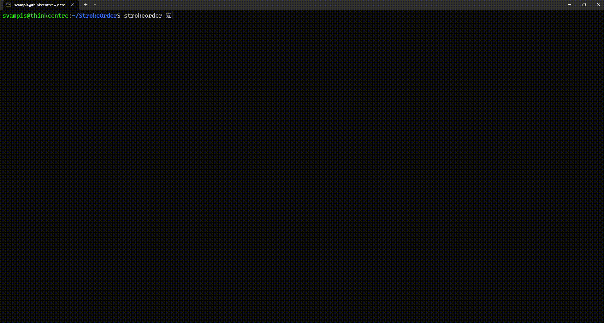
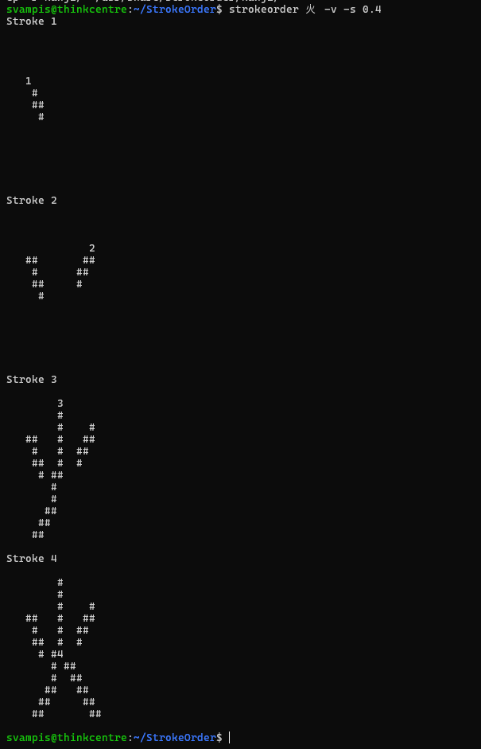

# StrokeOrder: a tool for displaying the stroke order of kanji right from the comfort of your own command prompt



## Installation
To compile and install the program, simply do the following on a linux machine with gcc installed.
```sh
make
sudo make install
```
You may also uninstall by doing the following
```sh
sudo make uninstall
```

## Usage
To view a stroke order animation of some kanji, simply run the `strokeorder` command as shown below.
```sh
strokeorder 猫
```
In addition, you can also pass in a -v flag and an -s [n] flag after the kanji. The -v flag will cause the program to print out a static stroke order diagram, with the start of the stroke marked by the stroke number, and the -s [n] flag will scale the image by a factor of [n]. [n] is a decimal value like 1.332.

```sh
# scales the kanji down to half size
strokeorder 猫 -s 0.5

# prints a static stroke order diagram at 1.5 times usual size
strokeorder 猫 -v -s 1.5
```


## Credits

This software uses the following third-party resources:

### NanoSVG
- Author: Mikko Mononen
- License: zlib/libpng-style license
- Description: A simple C library for parsing and rendering SVG files.
- Source: [https://github.com/memononen/nanosvg](https://github.com/memononen/nanosvg)

---

### KanjiVG
- Author: Ulrich Apel
- License: [Creative Commons Attribution-ShareAlike 3.0 (CC BY-SA 3.0)](https://creativecommons.org/licenses/by-sa/3.0/)
- Description: Vector graphics data for kanji stroke order.
- Source: [https://kanjivg.tagaini.net](https://kanjivg.tagaini.net)

In this software, the KanjiVG SVG files have been modified with renamed file names and decreased stroke widths.

